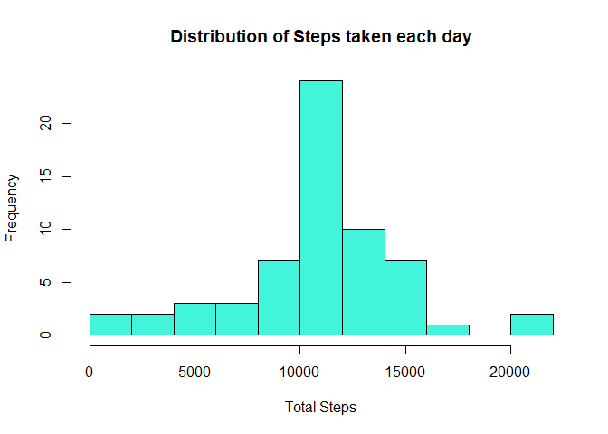

# Reproducible Research: Peer Assessment 1


###1.0 Loading the data


```r
if(!file.exists("./activityMonitoringData"))
  {dir.create("./activityMonitoringData")}
fileUrl <- "https://d396qusza40orc.cloudfront.net/repdata%2Fdata%2Factivity.zip"
download.file(fileUrl,destfile="./activityMonitoringData.zip",method="libcurl")
unzip(zipfile="./activityMonitoringData.zip",exdir="./data")
pathFile <- file.path("./data" , "activity.csv")
activityData <- read.table(pathFile, sep = ",", header = T)
str(activityData)
```

```
## 'data.frame':	17568 obs. of  3 variables:
##  $ steps   : int  NA NA NA NA NA NA NA NA NA NA ...
##  $ date    : Factor w/ 61 levels "2012-10-01","2012-10-02",..: 1 1 1 1 1 1 1 1 1 1 ...
##  $ interval: int  0 5 10 15 20 25 30 35 40 45 ...
```


###2.0 Evaluating the mean total number of steps taken per day 

The missing data is ignored


```r
Data1 <- aggregate(steps ~ date, activityData, mean)
str(Data1)
```

```
## 'data.frame':	53 obs. of  2 variables:
##  $ date : Factor w/ 61 levels "2012-10-01","2012-10-02",..: 2 3 4 5 6 7 9 10 11 12 ...
##  $ steps: num  0.438 39.417 42.069 46.16 53.542 ...
```


###3.0 A histogram of mean total number of steps taken each day


```r
steps <- as.numeric(Data1$steps)
hist(steps, breaks=15, main = "Distribution of Steps taken each day", col = "#42f4d9", xlab = "Total Steps")
```

<!-- -->


###4.0 Mean steps per day 

Calculating the mean steps per day ignoring the missing values


```r
Mean_Steps <- round(mean(Data1$steps), 0)
Mean_Steps
```

```
## [1] 37
```


Calculating the median steps per day ignoring the missing values


```r
Median_Steps <- round(median(Data1$steps), 0)
Median_Steps
```

```
## [1] 37
```


###5.0 What is the average daily activity pattern?


```r
daily_Average_Steps <- aggregate(steps ~ interval, activityData, mean)
str(daily_Average_Steps)
```

```
## 'data.frame':	288 obs. of  2 variables:
##  $ interval: int  0 5 10 15 20 25 30 35 40 45 ...
##  $ steps   : num  1.717 0.3396 0.1321 0.1509 0.0755 ...
```

Making a time series plot of the 5-minute interval and the average number of steps taken, averaged across all days (y-axis)


```r
plot(daily_Average_Steps$interval, daily_Average_Steps$steps,  type = "l", main = "Average daily activity pattern", xlab = "Interval", ylab = "Steps", col="blue")
```

<!-- -->


###6.0 The 5-minute interval containing the maximum number of steps.


```r
highestNumberOfSteps <- max(daily_Average_Steps$steps)
subset(daily_Average_Steps, daily_Average_Steps$steps == highestNumberOfSteps)$interval
```

```
## [1] 835
```


###7.0 Imputing missing values

The presence of missing days (coded as `NA`) may introduce bias into some calculations or summaries of the data.

It can be observed from the summary data that there is 2304 NA values. Alternatively it can be calculated as shown below


```r
nrow( activityData[ activityData$steps=="NA", ])
```

```
## [1] 2304
```


Replacing the NAs with the mean


```r
activityData$steps[which(is.na(activityData$steps))] <- mean(na.omit(activityData$steps))
head(activityData)
```

```
##     steps       date interval
## 1 37.3826 2012-10-01        0
## 2 37.3826 2012-10-01        5
## 3 37.3826 2012-10-01       10
## 4 37.3826 2012-10-01       15
## 5 37.3826 2012-10-01       20
## 6 37.3826 2012-10-01       25
```


###8.0 Evaluating the mean total number of steps without NA`s

Average daily total number of steps


```r
Data2 <- aggregate(steps ~ date, activityData, sum)
Data1$steps <- as.numeric(Data1$steps)
str(Data2)
```

```
## 'data.frame':	61 obs. of  2 variables:
##  $ date : Factor w/ 61 levels "2012-10-01","2012-10-02",..: 1 2 3 4 5 6 7 8 9 10 ...
##  $ steps: num  10766 126 11352 12116 13294 ...
```

```r
summary(Data2)
```

```
##          date        steps      
##  2012-10-01: 1   Min.   :   41  
##  2012-10-02: 1   1st Qu.: 9819  
##  2012-10-03: 1   Median :10766  
##  2012-10-04: 1   Mean   :10766  
##  2012-10-05: 1   3rd Qu.:12811  
##  2012-10-06: 1   Max.   :21194  
##  (Other)   :55
```


###9.0 Making a histogram of mean total number of steps taken each day


```r
steps <- as.numeric(Data2$steps)
hist(steps, breaks=15, main = "Distribution of Steps taken each day", col = "#42f4d9", xlab = "Total Steps")
```

<!-- -->


###10.0 Conclusion

The mean and median of the data containg NA values are different. When the NA values are replaced with the average the resulting **mean** and **median** are exactly the same value. This shows that the NA values introduce skewness and replacing the NA values remove the skewness.


###11.0 Activity patterns differences between weekdays and weekends

Showing the days of the week


```r
activityData$date <- weekdays(as.Date(activityData$date))
str(activityData)
```

```
## 'data.frame':	17568 obs. of  3 variables:
##  $ steps   : num  37.4 37.4 37.4 37.4 37.4 ...
##  $ date    : chr  "Monday" "Monday" "Monday" "Monday" ...
##  $ interval: int  0 5 10 15 20 25 30 35 40 45 ...
```

Selecting week days data only


```r
weekdaysActivity <- subset(activityData, activityData$date=="Monday"| activityData$date=="Tuesday" |activityData$date=="Wednesday"| activityData$date=="Thursday" | activityData$date=="Friday")
head(weekdaysActivity)
```

```
##     steps   date interval
## 1 37.3826 Monday        0
## 2 37.3826 Monday        5
## 3 37.3826 Monday       10
## 4 37.3826 Monday       15
## 5 37.3826 Monday       20
## 6 37.3826 Monday       25
```

Weekday Activity pattern


```r
library(ggplot2)
Interval <- seq(0, 2355, 5)
list0 <- seq(1: length(Interval)) 
Steps <- numeric(length(list0))
for(i in list0)
{
   list1 <- seq(i, 12960, 288)
   meansList <- numeric(length(list1))
   
     for(j in list1)
       {
         meansList[j] <- weekdaysActivity[j, 1]
       }
 Steps[i] <- mean(meansList, na.rm = T)
}
weekday <- data.frame(Interval, Steps)
ggplot(weekday, aes(Interval,Steps)) + geom_line(color = "#df42f4", size=1/4, alpha=1) + labs(title="Weekday Activity Pattern") + theme(plot.title = element_text(hjust = 0.5))
```

<!-- -->

Selecting weekend days data only


```r
weekendActivity <- subset(activityData, activityData$date=="Saturday"| activityData$date=="Sunday")
```

The weekend pattern

```r
Interval <- seq(0, 2355, 5)
list0 <- seq(1: length(Interval)) 
Steps <- numeric(length(list0))
for(i in list0)
{
   list1 <- seq(i, 4608, 288)
   meansList <- numeric(length(list1))
   
     for(j in list1)
       {
         meansList[j] <- weekendActivity[j, 1]
       }
 Steps[i] <- mean(meansList, na.rm = T)
}
weekend <- data.frame(Interval, Steps)
ggplot(weekend, aes(Interval,Steps)) + geom_line(color = "#f44283", size=1/4, alpha=1) + labs(title="Weekend Daily Activity Pattern") + 
  theme(plot.title = element_text(hjust = 0.5))
```

<!-- -->

###12.0 Comparison of Week days and Weekends activity


```r
par(mfrow = c(2,1))
plot(weekday$Steps, type="l", main = "Weekday activity pattern", xlab = "Interval", ylab = "Steps", col="blue")
plot(weekend$Steps, type="l", main = "Weekend activity pattern", xlab = "Interval", ylab = "Steps", col="blue")
```

<!-- -->


###13.0 Observations and Conclusions


The peak steps are around the intervals 500 and 2000 for both weekend and week days. The week days peak are higher than weekend peaks. Weekdays have the lower number of steps walked between intervals 500 and 1250 compared to the similar interval over the weekends.


